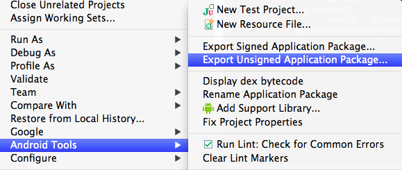

# Building

Figure out which android targets you have installed by running `android list targets`. You need to pick one. Then:

    $ cd into/this/repo
    $ android update project --target 5 --path .

.. where `5` equals whatever Android sdk level you want targetted and is listed from `android list targets`. One more thing!

    $ ant debug

You should now have a `clean_apk-debug.apk` under the `bin/` directory.

After building `Clean.apk` run `java -jar unsign.jar Clean.apk`

[unsign](https://github.com/bootstraponline/unsign)

To build, use the export option in Eclipse.

